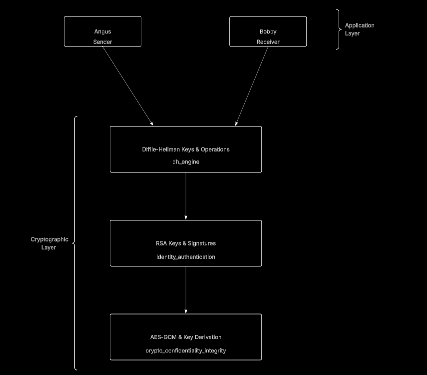

# Secure Diffie-Hellman Key Exchange - Cryptography Assessment

This project implements a secure, authenticated Diffie-Hellman key exchange between two parties (Angus and Bobby), providing confidentiality, integrity, and authentication over an insecure network using Python.

The system uses:

- Ephemeral Diffie–Hellman (DHE) for shared secret establishment  
- RSA identity keys and signatures for authentication  
- AES‑GCM for encryption and integrity protection  

Two attacker scripts demonstrate robustness against:

- Forged identities  
- Tampered ciphertext (MITM on the encrypted channel)  

---

## Architecture

The system is structured in three cryptographic layers beneath the application layer:

1. **Diffie–Hellman Keys & Operations** (`dh_engine.py`)  
2. **RSA Keys & Signatures** (`identity_authentication.py`)  
3. **AES‑GCM & Key Derivation** (`crypto_confidentiality_integrity.py`)  

The application layer consists of:

- `angus.py` — sender  
- `bobby.py` — receiver  

Attacker simulations:

- `attacker_forged_identity.py` — sends random DH/RSA material and signature to test authentication failure  
- `attacker_tampered_ciphertext.py` — performs a valid handshake, then flips bits in the ciphertext to trigger AES‑GCM integrity failure

---

## Files

- **dh_engine.py**
  - Generates DHE parameters (safe prime p, generator g)
  - Creates ephemeral private keys
  - Serialises public keys to PEM bytes
  - Deserialises peer public keys
  - Computes the shared secret via `private_key.exchange(...)`

- **crypto_confidentiality_integrity.py**
  - Derives a 256‑bit symmetric key from the DH shared secret using SHA256
  - Encrypts plaintext with AES‑GCM using a 96‑bit nonce
  - Decrypts ciphertext and raises on tampering (integrity/authentication failure)

- **identity_authentication.py**
  - Generates long‑term RSA identity keys (2048‑bit, exponent 65537)
  - Serialises public keys to PEM bytes
  - Signs data (including DH public keys) with RSA + PKCS#1 v1.5 + SHA256
  - Deserialises peer public keys from PEM bytes
  - Verifies signatures and raises on failure

- **angus.py (Sender)**
  - Generates RSA identity and DHE key pair
  - Connects to Bobby’s socket (localhost:8888)
  - Sends DH public key, RSA public key, and signature
  - Verifies Bobby’s identity and DH key
  - Computes shared secret and derives AES key
  - Encrypts a plaintext message and sends nonce + ciphertext

- **bobby.py (Receiver)**
  - Generates RSA identity and DHE key pair
  - Listens on localhost:8888 and accepts a connection
  - Receives Angus’ DH public key, RSA public key, and signature
  - Verifies Angus’ identity and DH key
  - Sends its own DH public key, RSA public key, and signature
  - Computes shared secret and derives AES key
  - Receives nonce + ciphertext, decrypts, and prints plaintext
  - Safely terminates on any cryptographic error

- **attacker_forged_identity.py**
  - Connects to Bobby and sends random bytes as DH key, RSA key, and signature
  - Demonstrates that malformed keys/signatures are rejected and the session is terminated

- **attacker_tampered_ciphertext.py**
  - Performs a valid handshake like Angus
  - Encrypts a message, then flips bits in the ciphertext
  - Demonstrates AES‑GCM integrity failure and safe termination on Bobby’s side

---

## How to run

1. Start Bobby (receiver):

   python bobby.py

2. In another terminal, run Angus (sender):

   python angus.py

3. To test forged identity:

   python attacker_forged_identity.py

4. To test tampered ciphertext:

   python attacker_tampered_ciphertext.py

---

## Security properties demonstrated

- **Confidentiality**
  - Ephemeral Diffie–Hellman shared secret
  - AES‑GCM encryption with a derived symmetric key

- **Integrity**
  - AES‑GCM authentication tag detects ciphertext tampering
  - Exceptions raised on decryption failure

- **Authentication**
  - RSA identity keys and signatures bind DH public keys to identities
  - Forged identities and malformed keys are rejected

- **Robustness & secure failure**
  - All critical operations wrapped in try/except
  - Cryptographic exceptions lead to clean session termination
  - No invalid keys or signatures are accepted

---

